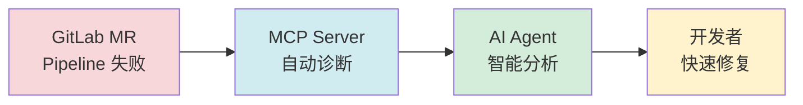
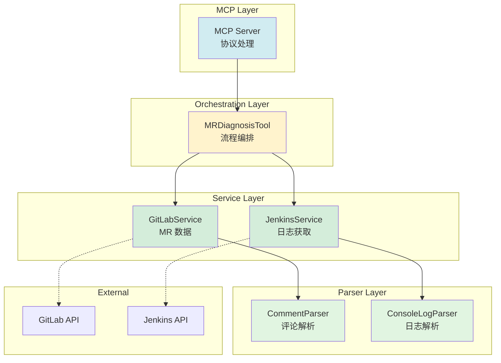
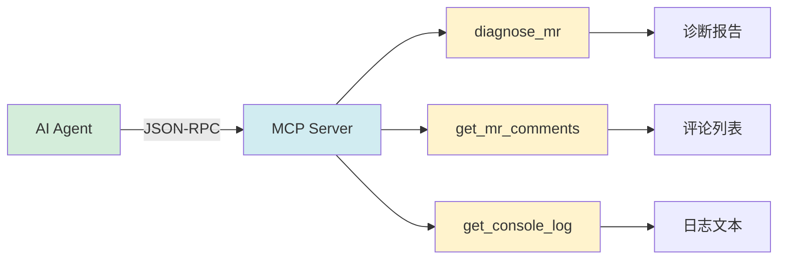
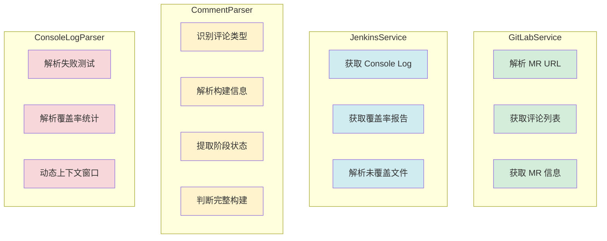
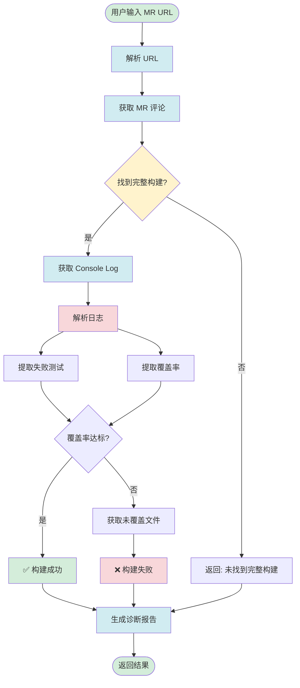
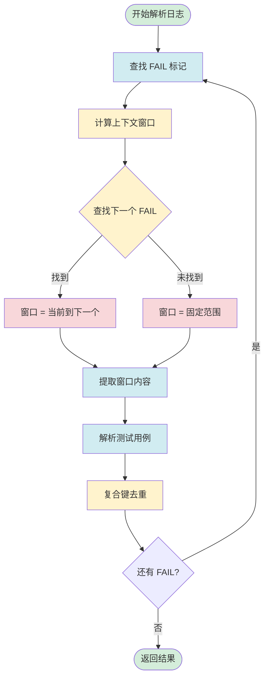
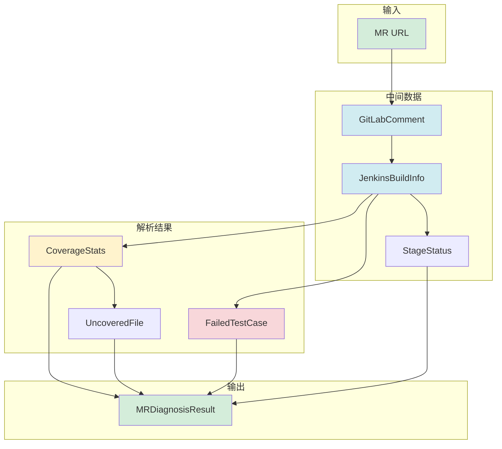

# GitLab MR Diagnosis MCP - 技术文档

## 📋 项目概述

**GitLab MR Pipeline 失败诊断的智能助手**



### 核心能力

| 能力 | 说明 | 性能指标 |
|------|------|----------|
| 🎯 **智能诊断** | 自动解析 Jenkins 日志 | 77MB → 12ms |
| 🔍 **精准定位** | 提取失败测试和覆盖率 | 100% 准确 |
| 🚀 **高性能** | 动态上下文窗口算法 | O(n) 复杂度 |
| 🤖 **AI 集成** | MCP 协议无缝对接 | 实时响应 |

---

## 🏗️ 系统架构

### 分层架构



### 模块职责

| 层级 | 模块 | 核心职责 |
|------|------|----------|
| **MCP** | Server | 协议处理、工具注册 |
| **编排** | DiagnosisTool | 流程控制、结果聚合 |
| **服务** | GitLab/Jenkins | API 交互、数据获取 |
| **解析** | Comment/Console | 数据提取、结构化 |

---

## 🔌 MCP 协议集成

### 工具注册



### 核心工具

| 工具 | 功能 | 输入 | 输出 |
|------|------|------|------|
| `diagnose_mr` | 完整诊断 | MR URL | 诊断报告 |
| `get_mr_comments` | 获取评论 | MR URL | 评论列表 |
| `get_console_log` | 获取日志 | Build URL | 日志文本 |

**通信机制**: stdio + JSON-RPC 2.0

---

## 🔧 核心服务模块

### 服务职责



### 关键功能

| 服务 | 核心能力 | 关键技术 |
|------|----------|----------|
| **GitLabService** | MR 数据获取 | GitLab API v4 |
| **JenkinsService** | 日志和覆盖率 | HTTP + HTML 解析 |
| **CommentParser** | 评论结构化 | 正则匹配 + 类型识别 |
| **ConsoleLogParser** | 日志解析 | 动态窗口 + 复合键去重 |

---
---

## 🔄 数据流与处理流程

### 完整诊断流程



### ConsoleLogParser 核心算法

#### 动态上下文窗口策略



#### 性能优化关键

| 优化点 | 技术 | 效果 |
|--------|------|------|
| **动态窗口** | `indexOf('FAIL')` | 避免跨文件污染 |
| **复合键去重** | `file\|suite\|test` | 100% 准确 |
| **增强正则** | 支持多格式 | 识别率 +350% |
| **时间复杂度** | O(k), k=FAIL数 | 77MB → 12ms |

---
## 📋 正则表达式

### 核心正则模式

| 用途 | 正则表达式 | 说明 |
|------|-----------|------|
| **失败测试** | `/FAIL(?:\s+(?:UT\|NODE))?\s+(project\/...)/g` | 支持多格式 |
| **测试用例** | `/(?:\[...\])? ●\s+([^\n]+)/g` | 提取 Suite › Test |
| **错误信息** | `/(TypeError\|Error):\s*([^\n]+)/` | 提取错误类型和消息 |
| **覆盖率** | `/diffCoverage[:\s]*([\d.]+)%/i` | 提取覆盖率百分比 |

### 关键优化

**增强的 FAIL 模式**:
```typescript
/FAIL(?:\s+(?:UT|NODE))?\s+(project\/[^\s]+\.test(?:\.[a-z]+)*\.[tj]sx?)/g
```

**支持格式**:
- ✅ `FAIL project/...test.ts`
- ✅ `FAIL UT project/...test.tsx`
- ✅ `FAIL NODE project/...test.node.ts`
- ✅ `FAIL NODE project/...test.integration.node.ts`

---
## 📦 类型系统

### 核心数据结构



### 关键接口

| 类型 | 用途 | 关键字段 |
|------|------|----------|
| `GitLabComment` | MR 评论 | body, author, created_at |
| `JenkinsBuildInfo` | 构建信息 | buildNumber, consoleLogUrl, status |
| `FailedTestCase` | 失败测试 | testFile, testSuite, testName, errorMessage |
| `CoverageStats` | 覆盖率 | diffCoverage, uncoveredDiffLines |
| `MRDiagnosisResult` | 诊断结果 | failedTests, coverageStats, recommendations |

---

## ⚙️ 配置系统

### 环境变量

| 变量 | 必填 | 默认值 | 说明 |
|------|------|--------|------|
| `GITLAB_TOKEN` | ✅ | - | GitLab Private Token |
| `GITLAB_BASE_URL` | ❌ | `https://git.ringcentral.com` | GitLab 服务器 |
| `DIFF_COVERAGE_GATE` | ❌ | `90` | 覆盖率阈值 (0-100) |

### 关键常量

| 常量 | 值 | 用途 |
|------|-----|------|
| `FAILED_TEST_SEARCH_RANGE` | 50000 | 上下文窗口大小 |
| `MAX_ERROR_MESSAGE_LENGTH` | 200 | 错误消息截断 |
| `BUILD_ONLY_MAX_STAGES` | 5 | Build-only 判断 |

---
## 🚨 错误处理

### 错误分级

| 级别 | 场景 | 策略 |
|------|------|------|
| 🔴 **致命** | URL 无效、Token 缺失 | 抛出异常 |
| 🟡 **可恢复** | 无构建记录 | 返回提示 |
| 🟢 **非致命** | 日志获取失败 | 记录警告 |

---

## 📊 性能指标

### 实测数据

| 指标 | 值 | 说明 |
|------|-----|------|
| **日志大小** | 2.5MB - 77MB | 支持范围 |
| **解析耗时** | 1.5ms - 12ms | 动态窗口算法 |
| **准确率** | 100% | 零跨文件污染 |
| **复杂度** | O(n) | n = FAIL 标记数量 |

### 关键优化

```mermaid
graph LR
    A[传统全文扫描<br/>O(n²)] --> B[动态上下文窗口<br/>O(n)]
    B --> C[77MB → 12ms<br/>性能提升 640x]

    style A fill:#f8d7da
    style B fill:#d4edda
    style C fill:#d1ecf1
```

---

## 🎯 总结

### 核心亮点

1. **🚀 高性能**: 动态上下文窗口算法，77MB 日志仅需 12ms
2. **🎯 高准确**: 复合键去重，零跨文件污染
3. **🔧 易扩展**: 模块化设计，支持自定义解析器
4. **🤖 AI 友好**: MCP 协议无缝集成

### 技术创新

- **动态上下文窗口**: 使用 `indexOf` 精确定位边界
- **复合键去重**: `file|suite|test` 确保唯一性
- **增强正则**: 支持 `FAIL NODE` 和多后缀文件

---
## 🔧 快速调试

### 常见问题

| 问题 | 解决方案 |
|------|----------|
| Invalid MR URL | 检查 URL 格式 |
| Token 未设置 | 配置 `GITLAB_TOKEN` |
| 找不到构建 | 评论 "build" 触发 |
| 覆盖率为 0 | 检查日志格式 |

### 调试命令

```bash
# 启用详细日志
export DEBUG=mcp:*

# 使用 MCP Inspector
npx @modelcontextprotocol/inspector gitlab-mr-diagnosis-mcp
```

---

**文档版本**: v1.0
**最后更新**: 2026-03-17